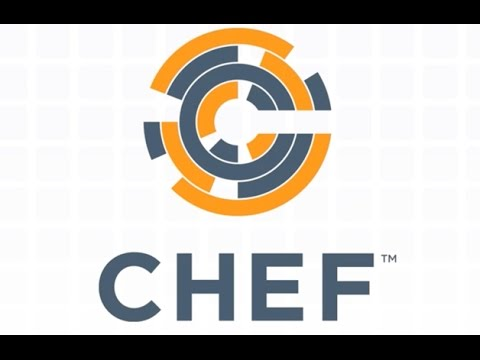

__O que é Chef__

Chef é uma Plataforma de automação para gerenciar configurações de infraestrutura.

# Mas o que isso significa ?

A idéia é centralizar as configurações e ter uma ferramenta que vai aplicar essa configuração como um deploy de uma aplicação. Dessa forma sua
configuração vira um código e a infraestrutura passa a ter caracteristicas de uma aplicação.

# IaC

infraestrutura como um codigo (IaC) é o conceito de transformar a configuração da infraestrutura em código. Dessa forma sua infra ganha atributos de uma aplicação:
 - Versionar
 - Reutilizar
 - Testar

 Com isso ganhamos mais VELOCIDADE na implementações e mais SEGURANÇA pois o codigo antes de ser implementado, pode ser testado.

 # Tecnologias do Chef

- Chef é uma ferramenta Open source e tem uma versão Enterprise com alguns poucos recursos a mais e suporte.
- Chef é escrito em Ruby
- Chef usa pure-Ruby, domain-specific language (DSL) para escrever as "receitas"
- Chef é uma ferramenta de linha de comando
- Chef é baseado em uma arquitetura Client-Servidor

# Concorrentes
 - Puppet
 - Ansible
 - Saltstack
